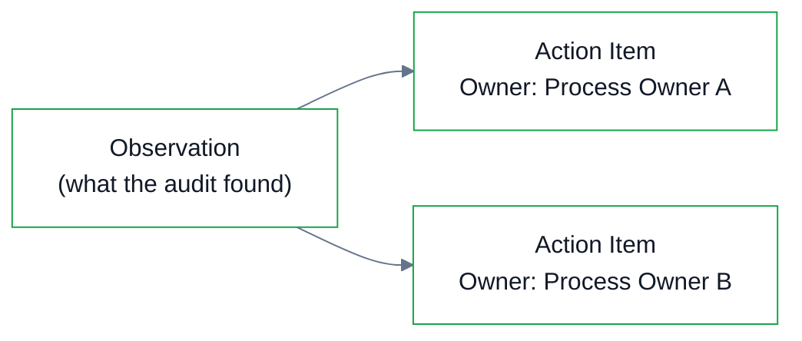
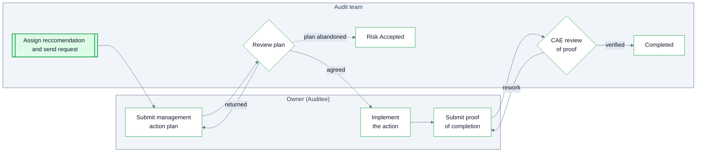

Action items are child cases of the parent engagement.  Each action always traces back to the audit that raised it and **persist after the report is issued**.

Action items reference back to Observations. Each action item refers to one observation, while an observation can have multiple action items. This allows complex observations — ones that require multiple process owners or multiple steps to address — to be modelled cleanly instead of forced into a single Action Item.

## Lifecycle

An action item is assigned to its owner (an auditee). The owner is notified by email and requested for a **management action plan.** This request contains Internal Audit's **Recommendation** and a summary of the **Relevant** **Observation**.

After creating a plan and specifying a due-date, management can submit their plan for review.  

Management is then regularly notified of the due date and any overdue items. When the item has been completed, management can log into the portal and mark work as done and submit **proof of completion**. This is then routed for **CAE review**  

If management deems a risk to be acceptable, they can reject the creation of an action plan and instead log their risk acceptance with a justification. An item can exit as **Risk Accepted** (the plan was abandoned and the CAE determined the risk is formally accepted) or **Withdrawn**.

## Action Item Status

Their statuses (complete, risk accepted, in progress, overdue) roll up into the audit report.

| Status | Description |
| --- | --- |
| Plan Requested | After the plan has been created and the auditor is awaiting management's plan. |
| In Progress | After the Action Plan has been approved. |
| Awaiting Review | After management has submitted proof of completion to auditors for review. |
| Completed | Once management's evidence has been approved by the audit team. |
| Risk Accepted | If management rejects a reccommendation, or accepts an observation's identified risk. |
| Overdue | Action Items that are still awaiting management submission and past the due-date. |

## The commitment

Each action item captures management's plan in management's words: the action plan, the owner, the target date. The observation's risk rating is copied onto the action item at creation.

The **original target date is locked**; extensions update a current target date with the revision history preserved. Allowing the system to track the % of items remediated on-time.