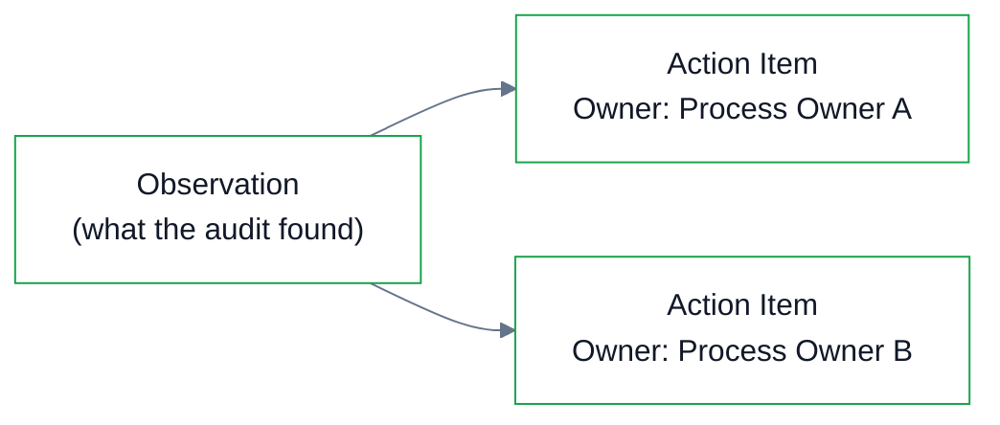
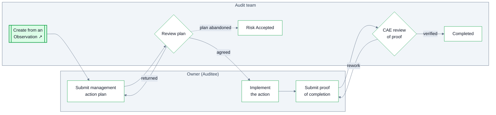

Action items reference back to Observations. Each action item refers to one observation, while an observation can have multiple action items. This allows complex observations — ones that require multiple process owners or multiple steps to address — to be modeled cleanly instead of forced into a single task.

Action items are child cases of their engagement — so every action always traces back to the audit that raised it — and they **persist after the report is issued**, tracked in the engagement's final stage until every observation is remediated. Their statuses (complete, risk accepted, in progress, overdue) roll up into the audit report.

## The commitment

Each action item captures management's plan in management's words: the action plan, the owner, the target date. The observation's risk rating is copied onto the action item at creation — a rating adjusted later during report review shouldn't silently change what management committed against.

The **original target date is locked**; extensions update a current target date with the revision history preserved.

## Two statuses, deliberately

| Status | Whose claim it is |
| --- | --- |
| **Management-Reported Status** | Management says where the action stands. |
| **IA Confirmation Status** | Internal Audit *confirms* it — Not Verified / Verified Implemented / Verified Partial / Verified Not Implemented, with the verification method (inquiry, evidence reviewed, retested) recorded. |

These never collapse into one field: "closed" must be unambiguous about who decided, and "verified" by inquiry alone is a much weaker claim than retesting — a difference that matters when reporting closures to the board.

## Closure

An observation is resolved only when **all** of its action items are verified — an observation cannot close with open children, and the observation view shows progress ("3 of 5 verified"). Closure reasons:

- **Implemented and Verified**
- **Superseded by Alternative Plan** — the accepted alternative is tracked to completion as its own action item, linked from the original
- **Risk Formally Accepted**
- **No Longer Applicable** — with a documented rationale

Overdue items carry management's explanation for the delay and the CAE's determination on whether continued inaction amounts to accepting risk beyond tolerance.

## Lifecycle

An action item is assigned to its owner, who submits the **management action plan**; the plan is reviewed (and can be returned) before work begins. When management reports the work done, the owner submits **proof of completion**, which goes to **CAE review** — with a rework loop — before the item completes. Alongside completion, an item can exit as **Risk Accepted** (the plan was abandoned and the CAE determined the risk is formally accepted) or **Withdrawn**.

