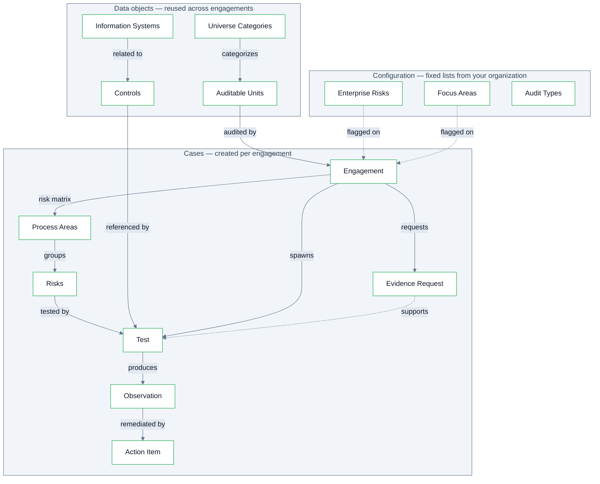

Recap IA is object oriented: every piece of data you touch is related to the others. There are three layers: **cases** (work that moves through a lifecycle), **data objects** (your organization's reference library, reused across engagements), and **configuration** (fixed lists from your organization, set up once).

## Case Types

Cases are the units of work. Each has its own lifecycle, assignments and approvals.

| Case Type | What it is |
| --- | --- |
| **Engagement** | The primary case: one audit, spanning planning through reporting. Connects across multiple data objects and other cases hang off it. |
| **Test** | A child case of the Engagement, one per step of the work program.  In other words, the work program _is_ the set of Tests. Each carries its purpose, procedure, sampling and window. Each test has it's own workpaper. See [Tests](/tests). |
| **Evidence Request** | A request to an auditee for support documents, linked to the test(s) it supports. These are tracked to fulfillment with regular email notifications sent to owners. See [Evidence Requests](/evidence-requests). |
| **Observation** | A deficiency or gap, documented within the test that found it (or directly on the engagement for findings outside testing). Reviewed by the CAE at the conclusion of the test, and locked at report issuance. See [Observations](/observations). |
| **Action Item** | A request for management action referencing the relevant Observation. Importantly, these persist even after reports are issued. See [Action Items](/action-items). |

Two primary forms of risks exist:

1. Engagement level **Risks** that are defined per engagement and scoped by process areas.  
2. And **Enterprise Risks** which are a configured list inherited from your ERM and referenced by Engagements and Auditable Units.

Each engagement's Risk Matrix is made of engagement-specific **Risk** records: the risks as assessed _for this audit_, with each rated for **Likelihood × Impact** and grouped under a **Process Area**.

## Data Objects

Data objects support your organization's unique audit universe. They are referenced across engagements, and help allow knowledge to accumulate across audits instead of being rebuilt each time.

| Data Object | What it is |
| --- | --- |
| **Universe Categories** | The top tier of the taxonomy (e.g. Expense, Revenue). Every auditable unit belongs to one. |
| **Auditable Units** | The entities that can be audited. Each contain a Universe Category and Audit Type, and store process areas, relevant controls and engagement history across engagements.   Units can be regulatory frameworks, business units or something unique to your organization. |
| **Controls** | The control library, grouped by Function. Selecting a control on a test pre-fills the test's purpose and procedure. See [Controls](/controls). |
| **Information Systems** | A simple log of the systems your organization runs on and that your audits touch. When relevant, systems tie to related controls. |

## Configuration

System configurations are semi-fixed lists that tailor Recap IA to your organization. These lists can have records added or removed, although these adjustments must be made by the CAE and as as such these lists are typically not adjusted as frequently as other data objects.

| Configuration | What it is |
| --- | --- |
| **Enterprise Risks** | The fixed risk list from your ERM function, flagged on each relevant engagement it applies to. |
| **Focus Areas** | Organization-defined lenses that engagements relate to alongside enterprise risks, where your methodology requires it. |
| **Audit Types** | Your classification of different types of audit work across the universe.  E.g. FX (Financial Statement), FO (Financial Operational), etc. |

## Users

| Role | What they do |
| --- | --- |
| **Auditor** | Popualtes assigned steps throughout the engagement and tests. Prepares fieldwork, workpapers and observations. |
| **Audit Manager** | Reviews and approves at critical steps of the engagement. This includes planning, programming and submitted fieldwork.  Acts as the CAE in the standard configuration. |
| **Auditee / Process Owner** | Responds to evidence requests and owns action items. Auditees are classified as _External users_, meaning they access Recap IA through an emailed magic link.   This simplifies their user experience by not requiring a distinct account or full login. |