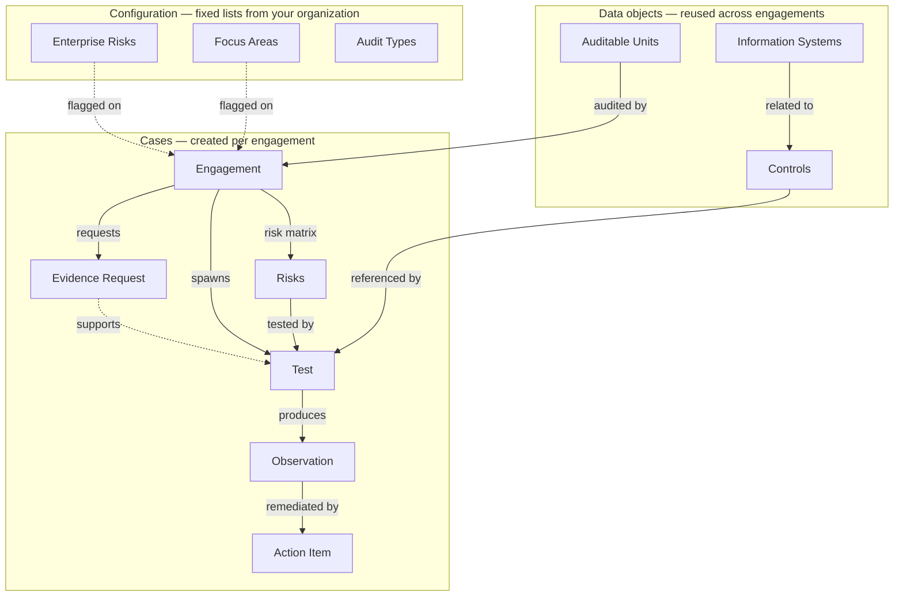

Recap IA is object oriented: every piece of data you touch is related to the others. There are three layers — **cases** (work that moves through a lifecycle), **data objects** (your organization's reference library, reused across engagements), and **configuration** (fixed lists from your organization, set up once).

## Case Types

Cases are the units of work. Each has its own lifecycle, assignments and approvals.

| Case Type | What it is |
| --- | --- |
| **Engagement** | The root case: one audit, run from planning through reporting. Everything else hangs off it. |
| **Test** | A child case of the Engagement, one per step of the work program — the work program *is* the set of Tests. Each carries its purpose, procedure, sampling and window, links to the control and risk it covers, and owns its workpaper. See [Tests](/tests). |
| **Evidence Request** | An engagement-level request to an auditee for support documents, linked to the test(s) it supports and tracked to fulfillment. See [Evidence Requests](/evidence-requests). |
| **Observation** | A deficiency or gap, documented within the test that found it (or directly on the engagement for findings outside testing). Approved by the CAE, locked at report issuance. See [Observations](/observations). |
| **Action Item** | A management action referencing one Observation, tracked to completion. A child case of the Engagement that persists after the report is issued. See [Action Items](/action-items). |

**Risks** sit between the configuration and the cases: each engagement's Risk Matrix is made of engagement-specific Risk records — the risks as assessed *for this audit*. Enterprise Risks from your ERM are flagged at the engagement level.

## Data Objects

Data objects are your organization's audit universe — configured once and referenced by every engagement, so knowledge accumulates across audits instead of being rebuilt each time.

| Data Object | What it is |
| --- | --- |
| **Auditable Units** | The entities that can be audited. Carry their Category (e.g. Expense, Revenue) and store data across engagements. |
| **Controls** | The control library, grouped by Function. Selecting a control on a test pre-fills the test's purpose and procedure. See [Controls](/controls). |
| **Information Systems** | The systems controls run on, related to each control. |

## Configuration

Fixed lists that tailor Recap IA to your organization — they come from documents you already maintain, not from the audit team's day-to-day work.

| Configuration | What it is |
| --- | --- |
| **Enterprise Risks** | The fixed risk list from your ERM function, flagged on each engagement it applies to. |
| **Focus Areas** | Organization-defined lenses that engagements relate to alongside enterprise risks, where your methodology requires it. |
| **Audit Types** | Your classification of audit work across the universe — for example FX (Financial Statement), FO (Financial Operational), CR (Compliance/Regulatory), IT (Info Security), FD (Fiduciary). |

## Users

| Role | What they do |
| --- | --- |
| **Auditor** | Runs assigned tests: fieldwork, workpapers, observations. |
| **Audit Manager** | Reviews and approves — planning memos, submitted workpapers, observations and draft reports. Acts as the CAE in the standard configuration. |
| **Auditee / Process Owner** | Responds to evidence requests and owns action items. |
