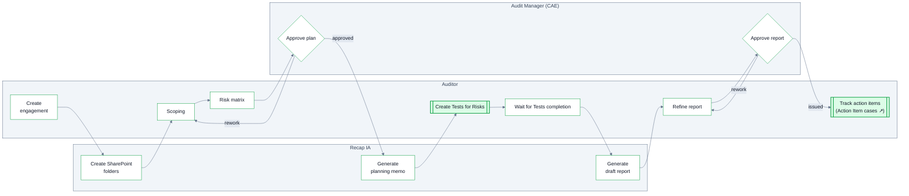

The Engagement is the root case of every audit. It moves through six stages, spawning child cases (Tests, Evidence Requests, Action Items) and generating documents (Planning Memo, Workpapers, Audit Report) along the way.

<Frame caption="The Engagement lifecycle in Recap IA">
  
</Frame>

## Lifecycle

**Double-bordered boxes are case boundaries**. Engagements involve other case type that each run their own workflow: see the swimlanes on [Tests](/tests#lifecycle), [Evidence Requests](/evidence-requests#review-loop) and [Action Items](/action-items#lifecycle).

<Steps>
  <Step title="Create Audit Engagement">
    Collect the engagement's details. On creation, Recap IA automatically creates the engagement's folder structure in SharePoint (if the [SharePoint integration](/sharepoint-fieldwork) is configured).
  </Step>
  <Step title="Planning">
    Scope the engagement and build the risk matrix — engagement-specific risk records assessed for this audit.  Upon submission,  CAE reviews the Engagement Plan. Once approved, Recap IA generates the **Planning Memo** as a PDF for final review before distribution to auditees.
  </Step>
  <Step title="Programming">
    For the program, auditors are able to create Tests and map them to the Risks identified in the planning stage.  Test's represent the steps of the audit program.  Each test also relates to a control in the library and carries a purpose, procedure and sampling information.
  </Step>
  <Step title="Field Work">
    Auditors execute their tests and complete workpapers. In each test case, auditor's draft the workpaper and log observations in RecapIA. After each test's fieldwork is complete the list of observations is submitted for review by the CAE. Once all fieldwork is complete the engagement moves to reporting.
  </Step>
  <Step title="Reporting">
    On the move into Reporting, an automation generates a first draft of the **Audit Report**.  This uses the engagement's fields, observations, and the status of action items.  Auditors can open it from the app to review and finalize the report. Once completed, the CAE reviews the report before it is issued.
  </Step>
  <Step title="Tracking Action Items">
    In response to observations Management action plans can be created at any time throughout the engagement. After the report is issued they can still be tracked through the engagement's case view. So follow-up can continue even after the report
  </Step>
</Steps>

## Key fields

At creation, the engagement captures its identity and configuration anchors:

| Field | Description |
| --- | --- |
| Name / Description | What this engagement is. |
| Audit Type | The kind of audit work (e.g. FX, FO, CR, IT, FD — [your configured types](/audit-universe#audit-types)). |
| Enterprise Risk | The ERM risk this engagement addresses. |
| Company Focus Area | The organizational focus area the engagement relates to. |
| Expected Completion Date | When the engagement is planned to finish. |

During Planning, the engagement's substance is built out — first in **Scoping**:

| Field | Description |
| --- | --- |
| Scope | Narrative scope — what is and isn't covered. |
| Scope Period Start / End | The period under review — the data window the audit covers. The **scope** date, deliberately separate from schedule dates so nobody filters on the wrong axis. |
| Objectives | The engagement's list of objectives. Every test maps back to one, so coverage can be checked in both directions. |
| Related Information Systems | The systems in scope. |
| Assigned Auditors / Auditees | Who's staffed on the audit, and who on the business side responds to it. |
| Audit Purpose / Audit Approach | Why the audit is being performed, and how it will be conducted. |

Then in the **Risk Matrix**, process areas are laid out with their risks (each rated for Likelihood and Impact and mapped to an objective), the walkthrough date and planning preparer/reviewer are recorded, and the whole plan is **submitted for approval**.

The scope-vs-schedule distinction carries down to each test: the [Test Window](/tests#test-fields) is a scope date the period its population covers.