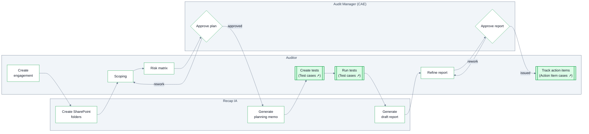

The Engagement is the root case of every audit. It moves through six stages, spawning child cases (Tests, Evidence Requests, Action Items) and generating documents (Planning Memo, Workpapers, Audit Report) along the way.

<Frame caption="The Engagement lifecycle in Recap IA">
  
</Frame>

## Lifecycle

<Steps>
  <Step title="Create Audit Engagement">
    Collect the engagement's details. On creation, Recap IA automatically creates the engagement's folder structure in SharePoint (if the [SharePoint integration](/sharepoint-fieldwork) is configured).
  </Step>
  <Step title="Planning">
    Scope the engagement and build the risk matrix — engagement-specific risk records assessed for this audit. The CAE reviews the scope, and can send it back for rework. Once approved, Recap IA generates the **Planning Memo** as a PDF for final review before fieldwork begins.
  </Step>
  <Step title="Programming">
    Risks embedded in the engagement are synced, and **[Tests](/tests)** are created as child cases — one per step of the audit program, each pre-filled from the control library and carrying its purpose, procedure, window and sampling plan.
  </Step>
  <Step title="Field Work">
    Auditors execute their tests and complete workpapers. As each test's observations are recorded, the list is submitted and **approved by the CAE**. The engagement waits for all tests to be submitted and reviewed before moving on.
  </Step>
  <Step title="Reporting">
    On the move into Reporting, an automation generates the draft **Audit Report** — pulling the engagement's fields, observations, and the status of action items (complete, risk accepted, in progress, overdue) — and places it in SharePoint. Auditors open it from the app to adjust formatting and text; from that point it's their responsibility to keep the deck aligned with the documentation. The CAE reviews, and can send it back to drafting, before the report is issued.
  </Step>
  <Step title="Tracking Action Items">
    Management's action plans are tracked as **[Action Item](/action-items)** cases until each observation's actions are verified. Action items persist after the report is issued, so follow-up continues without reopening the audit.
  </Step>
</Steps>

<Info>
  **Report issuance locks the record.** When the report is issued, observations lock — condition, criteria, root cause, effect, rating and recommendation become immutable, with a CAE unlock (reason required, audit-trailed) for corrections. Action items and dispositions stay editable through follow-up.
</Info>

## Who does what

**Double-bordered boxes are case boundaries** — the flow crosses into another case type that runs its own workflow: see the swimlanes on [Tests](/tests#lifecycle), [Evidence Requests](/evidence-requests#review-loop) and [Action Items](/action-items#lifecycle).

## Key fields

At creation, the engagement captures its identity and configuration anchors:

| Field | Description |
| --- | --- |
| Name / Description | What this engagement is. |
| Audit Type | The kind of audit work (e.g. FX, FO, CR, IT, FD — [your configured types](/audit-universe#audit-types)). |
| Enterprise Risk | The ERM risk this engagement addresses. |
| Company Focus Area | The organizational focus area the engagement relates to. |
| Expected Completion Date | When the engagement is planned to finish — a schedule date. |

During Planning, the engagement's substance is built out — first in **Scoping**:

| Field | Description |
| --- | --- |
| Scope | Narrative scope — what is and isn't covered. |
| Scope Period Start / End | The period under review — the data window the audit covers. A **scope** date, deliberately separate from schedule dates so nobody filters on the wrong axis. |
| Objectives | The engagement's objective list — every test maps back to one, so coverage can be checked in both directions. |
| Related Information Systems | The systems in scope. |
| Assigned Auditors / Auditees | Who's staffed on the audit, and who on the business side responds to it. |
| Audit Purpose / Audit Approach | Why the audit is being performed, and how it will be conducted. |
| Policies Reviewed | The policies and procedures reviewed — the sources later cited as criteria. |

Then in the **Risk Matrix**, process areas are laid out with their risks (each rated for Likelihood and Impact and mapped to an objective), the walkthrough date and planning preparer/reviewer are recorded, and the whole plan is **submitted for approval**.

The scope-vs-schedule distinction carries down to each test: the [Test Window](/tests#test-fields) is a scope date — the period its population covers, not when the testing happens.
