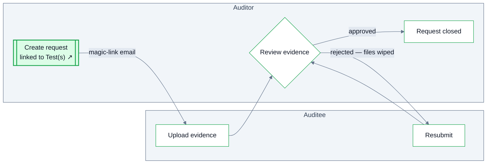

Evidence Requests are how the audit team asks auditees for support — populations, sample documents, policies, explanations — and tracks what's outstanding.

Requests are created at the **engagement level** and linked to the **test(s) they support**. Because a request can serve several tests, the link is what makes review work: you can see outstanding requests by objective, and spot a test with no supporting evidence before sign-off.

## Fields

| Field | Description |
| --- | --- |
| Description | What is being requested and why — including format, delivery and completeness expectations. |
| Auditee | Who provides the evidence — they receive a magic-link email and upload directly, no account needed. |
| Requester | Who on the audit team asked for it. |
| Evidence Period | The period the requested records should cover (distinct from when testing happens). |
| Due Date | When the evidence is needed by. |
| Supported Test(s) | The test(s) this request feeds. |
| Disposition | The request's outcome, tracked to closure. |

## Review loop

The auditee uploads evidence through their magic-link portal; the audit team reviews it. If the evidence is rejected, **the rejected files are wiped** and the auditee is asked to resubmit — the record never accumulates wrong versions, and the auditee can't be confused about which submission counts. Approval closes the request.

<Info>
  Population specifications — source, filters, completeness verification — belong on the [Test](/tests#describing-the-population), not on the request. The request points at the test; the test defines the population.
</Info>
