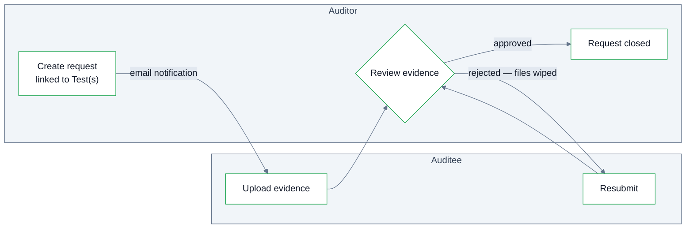

Evidence Requests are a way for auditors to request populations, sample documents, policies, explanations and easily track their status.

Requests are created at the **engagement level** and linked to the **test(s) they support**. 

## Fields

| Field | Description |
| --- | --- |
| Description | What is being requested and why — including format, delivery and completeness expectations. |
| Auditee | Who is responsible for providing the evidence |
| Requester | Who on the audit team asked for it. |
| Evidence Period | The period the requested records should cover. |
| Due Date | When the evidence is needed by. |
| Supported Test(s) | The test(s) this request feeds. |
| Disposition | The request's outcome, tracked to closure. |

## Auditee Notification

When an evidence request is created and assigned to an auditee they are notified and provided a link to access a Recap IA portal and upload the evidence. This allows auditors to easily track outstanding evidence requests and send automated reminders as due-dates approach or are exceeded.    

## Review loop

The auditee uploads evidence through the portal; the audit team reviews it. If the evidence is rejected, **the rejected files are wiped** and the auditee is asked to resubmit. 

<Note>
  To ensure security, auditees can only upload data and when resubmitting evidence, they cannot see previous submissions. Reducing risk of hijacked links.
</Note>

