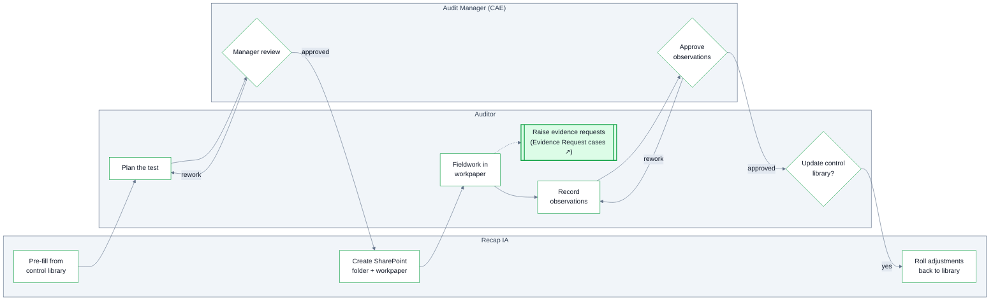

Tests are child cases of the Engagement, created in the Programming stage — one per step of the audit program. The work program is the set of Tests: approving it and executing it happens through them, and each test owns its own [workpaper](/document-templates#workpaper) in SharePoint.

## Lifecycle

Each test runs through its own stages:

1. **Planning** — the test is planned (pre-filled from its control, then tailored) and goes to **Manager Review**. The reviewer approves the test's procedures — or sends them back for rework — **before any fieldwork begins**, so every test's work program is approved prior to execution, test by test.
2. **In Progress** — on approval, Recap IA automatically creates the test's SharePoint folder and its pre-populated workpaper. Auditors execute the test, then record observations, which are submitted for CAE approval (with a return-for-rework loop).
3. **Completed** — the auditor makes the [roll-back choice](#pre-filled-from-the-control-library): whether tailored purpose/procedure updates the control library's canonical standard.

A test can also be **Withdrawn** at any point — descoped, not silently deleted.

## Pre-filled from the control library

When a test references a control, Recap IA pre-fills the test from the [control library](/controls), so standard tests don't get retyped every engagement:

| Control library field | Pre-fills on the Test |
| --- | --- |
| Standard Objective | Test Purpose |
| Standard Procedure | Procedure |

The auditor then tailors both to the engagement.

The flow works in reverse too: at the end of the test, if the pre-filled purpose or procedure was adjusted during testing, the auditor chooses whether those adjustments **roll back into the control library** as the new canonical Standard Objective and Standard Test Procedure. Control tests can diverge for one engagement's needs — and when an adjustment turns out to be a genuine improvement, it propagates to every future test of that control instead of dying with the engagement.

## Test fields

| Field | Description |
| --- | --- |
| Control | The control library entry this test evaluates. Optional — substantive or analytical work, control gaps, and entity-level work may have no control to route through. |
| Related Risk | The risk the test addresses. When a control is referenced, risk coverage is derived through the control; the direct link matters most when there is no control. |
| Related Objective | The engagement objective this test supports — so coverage can be checked in both directions: every objective has at least one test, every test serves at least one objective. |
| Process Area | The process area the test covers. |
| Assigned Auditors | Who executes the test — assignment drives workpaper edit access during fieldwork. |
| Assigned Reviewer | The Audit Manager who reviews and approves this test. |
| Test Purpose | Rich text. What this test concludes about, relative to its control and the engagement. |
| Procedure | Rich text. The steps performed — written so a prudent, informed person could repeat the work and reach the same conclusion: source of items, action taken, comparison basis, what counts as an exception, what evidence to retain. |
| Test Window Start / End | The scope period — the window the tested population covers (not when the testing work happens). |
| Test Window Rationale | Why that window was chosen. |
| Population Size / Sample Size | The counts behind the sample. |
| Population Description | What was tested and where it came from — see below. |
| Sampling Approach | Rich text. The sampling methodology and the rationale for the sample size. |

## Describing the population

A population description should identify: the source system and report or query used, the extraction date, the period covered, any filters or exclusions applied — and how completeness was verified.

> "Non-PO invoices posted in SAP for FY25, extracted 1/15/26 via ZFI_INVLIST. Excludes intercompany (company codes 8xxx) as out of scope. 14,203 records; total agreed to GL account 21000 activity for the period."

"The report is system-generated" is not completeness verification — the bar is a reconciliation or count agreement to an independent total. If completeness wasn't verified, say so explicitly rather than leaving it blank.

## Conclusion

Every test gets a written conclusion — a clean test must be distinguishable from an unperformed one. State what was tested, the results, and whether the test purpose was achieved; reference observations by ID rather than restating them.

Conclusions are never derived from the absence of observations: zero observations is also what an unperformed test, a descoped test, and a failed data extraction look like.

## Observations and review

Observations found during testing are [documented within the test](/observations). Once all of a test's observations are recorded, the list is submitted and approved by the CAE — or returned with the reviewer's feedback for rework.
