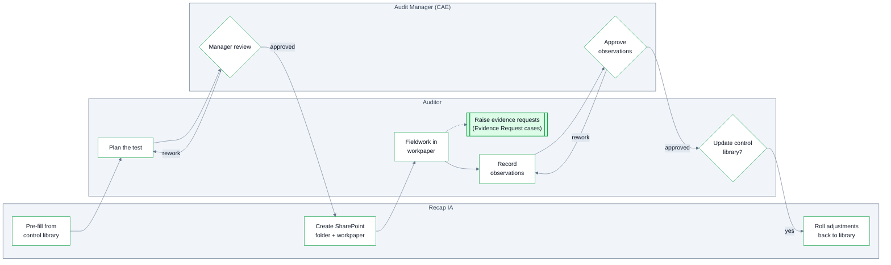

Tests are child cases of the Engagement, created in the Programming stage, one per step of the audit program. The work program is the set of Tests: approving it and executing it happens through them, with each test owning its own [workpaper](/document-templates#workpaper).

<Frame caption="Creating a Sample Test using a Control">
  <video src="/videos/Test-Creation.mp4" controls />
</Frame>

## Lifecycle

Each test runs through the following stages:

1. **Planning**: the control the test covers is selected and the test's procedures and purpose are pre-filled. Auditors then finalize the scope dates, along with the test's population and sampling information. Upon completion this is submitted for **Manager Review**. Approval is required **before any fieldwork begins**, so every test's work program is approved prior to execution. This ensures adherence with IIA standards.
2. **In Progress**: on approval, Recap IA automatically creates the test's SharePoint folder and its pre-populated workpaper. Auditors execute the test, then record observations, which are submitted for CAE approval (with a return-for-rework loop).
3. **Completed**: the auditor makes the [update decision](#pre-filled-from-the-control-library). Deciding whether any adjustments to the purpose/procedure update the control library's canonical standard.

## Pre-filled from the control library

When a test references a control, Recap IA pre-fills the test from the [control library](/controls), so standard tests don't get retyped every engagement:

| Control library field | Pre-fills on the Test |
| --- | --- |
| Standard Purpose | Test Purpose |
| Standard Procedure | Procedure |

The auditor then tailors both to the engagement.

The flow works in reverse too: at the end of the test, if the pre-filled purpose or procedure was adjusted during testing, the auditor chooses whether those adjustments **roll back into the control library** as the new canonical Standard Objective and Standard Test Procedure. Control tests can diverge for one engagement's needs — and when an adjustment turns out to be a genuine improvement, it propagates to every future test of that control instead of dying with the engagement.

## Test fields

| Field | Description |
| --- | --- |
| Control | The control library entry this test evaluates. |
| Related Risk | The engagement risk the test addresses. |
| Related Objective | The engagement objective this test supports.  Every objective has at least one test, every test serves at least one objective. |
| Assigned Auditors | Who executes the test.  Assignment drives workpaper edit access during fieldwork. |
| Assigned Reviewer | The Audit Manager who reviews and approves this test. |
| Test Purpose | What this test concludes about, relative to its control and the engagement. |
| Procedure | The steps to be performed. Written with repeatability in mind: source of items, action taken, comparison basis, what counts as an exception, what evidence to retain. |
| Test Window Start / End | The window the tested population covers. |
| Test Window Rationale | If different from the engagement's own test window then a rationale must be provided. |
| Population Size / Sample Size | The counts behind the sample. |
| Population Description | What was tested and where it came from. |
| Sampling Approach | The sampling methodology and the rationale for the sample size. |

## Describing the population

A population description should identify: the source system and report or query used, the extraction date, the period covered, any filters or exclusions applied and how completeness was verified.

## Observations and review

Observations found during testing are [documented within the test](/observations). Once fieldwork is complete and all of a test's observations are recorded, the list is submitted and for review by the CAE or returned with the reviewer's feedback for rework.

## Conclusion

Every test gets a written conclusion. State what was tested, the results, and whether the test purpose was achieved; reference observations by ID rather than restating them.